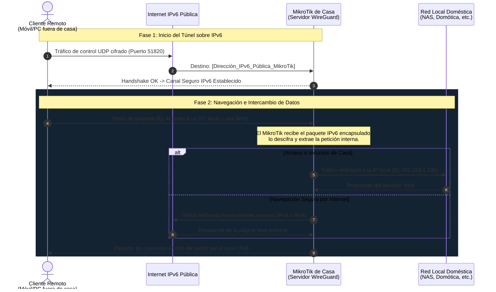
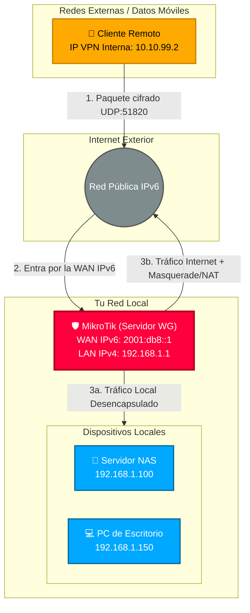

```mermaid
sequenceDiagram
    autonumber
    actor Cliente as Cliente Remoto<br/>(Móvil/PC fuera de casa)
    participant Net as Internet IPv6 Pública
    participant MT as MikroTik de Casa<br/>(Servidor WireGuard)
    participant LAN as Red Local Doméstica<br/>(NAS, Domótica, etc.)

    Note over Cliente, MT: Fase 1: Inicio del Túnel sobre IPv6
    Cliente->>Net: Tráfico de control UDP cifrado (Puerto 51820)
    Net->>MT: Destino: [Dirección_IPv6_Pública_MikroTik]
    MT-->>Cliente: Handshake OK -> Canal Seguro IPv6 Establecido
    
    rect rgb(20, 35, 50)
        Note over Cliente, LAN: Fase 2: Navegación e Intercambio de Datos
        Cliente->>MT: Envío de paquete (Ej: Acceder a un PC local o una Web)
        Note over MT: El MikroTik recibe el paquete IPv6 encapsulado,<br/>lo descifra y extrae la petición interna.
        
        alt Acceso a recursos de Casa
            MT->>LAN: Tráfico redirigido a la IP local (Ej: 192.168.1.100)
            LAN-->>MT: Respuesta del servidor local
        else Navegación Segura por Internet
            MT->>Net: Tráfico NATeado hacia Internet exterior (IPv4 o IPv6)
            Net-->>MT: Respuesta de la página Web externa
        end

        MT-->>Cliente: Paquete de respuesta cifrado de vuelta por el túnel IPv6
    end
```

```mermaid
graph TD
    %% Definición de estilos estéticos
    classDef cliente fill:#ffaa00,stroke:#cc7a00,stroke-width:2px,color:#000;
    classDef wan fill:#7f8c8d,stroke:#555,stroke-width:2px,color:#fff;
    classDef router fill:#FF003C,stroke:#b30022,stroke-width:3px,color:#fff;
    classDef lan fill:#00a8ff,stroke:#006699,stroke-width:2px,color:#fff;

    %% Dispositivo Externo
    subgraph Exterior_Fuera_de_Casa [Redes Externas / Datos Móviles]
        Móvil["📱 Cliente Remoto<br/>IP VPN Interna: 10.10.99.2"]:::cliente
    end

    %% Capa de Transporte de Internet
    subgraph Internet_Publica [Internet Exterior]
        Nube((Red Pública IPv6)):::wan
    end

    %% Tu Hogar / Laboratorio
    subgraph Red_Domestica [Tu Red Local]
        MT["🛡️ MikroTik (Servidor WG)<br/>WAN IPv6: 2001:db8::1<br/>LAN IPv4: 192.168.1.1"]:::router
        
        subgraph Recursos_LAN [Dispositivos Locales]
            NAS["💾 Servidor NAS<br/>192.168.1.100"]:::lan
            PC["💻 PC de Escritorio<br/>192.168.1.150"]:::lan
        end
    end

    %% Relaciones y Flujos de Tráfico
    Móvil -->|1. Paquete cifrado UDP:51820| Nube
    Nube -->|2. Entra por la WAN IPv6| MT
    
    %% Desencapsulado y Decisiones de Enrutamiento dentro del MikroTik
    MT -->|3a. Tráfico Local Desencapsulado| Recursos_LAN
    MT -->|3b. Tráfico Internet + Masquerade/NAT| Nube
```
